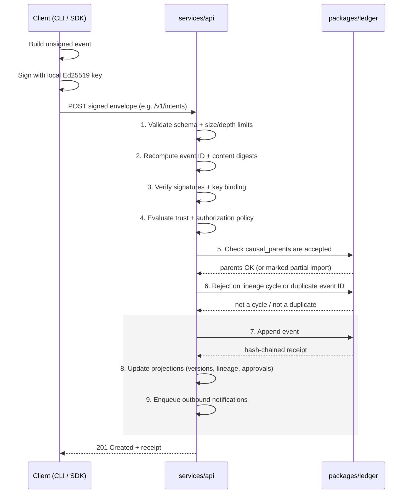
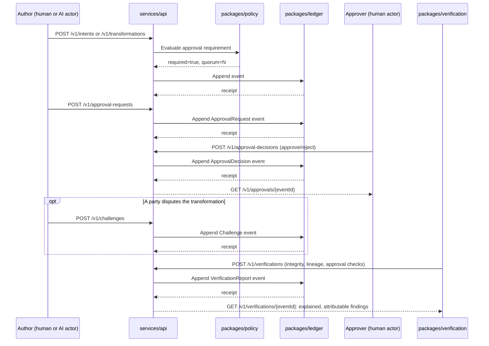
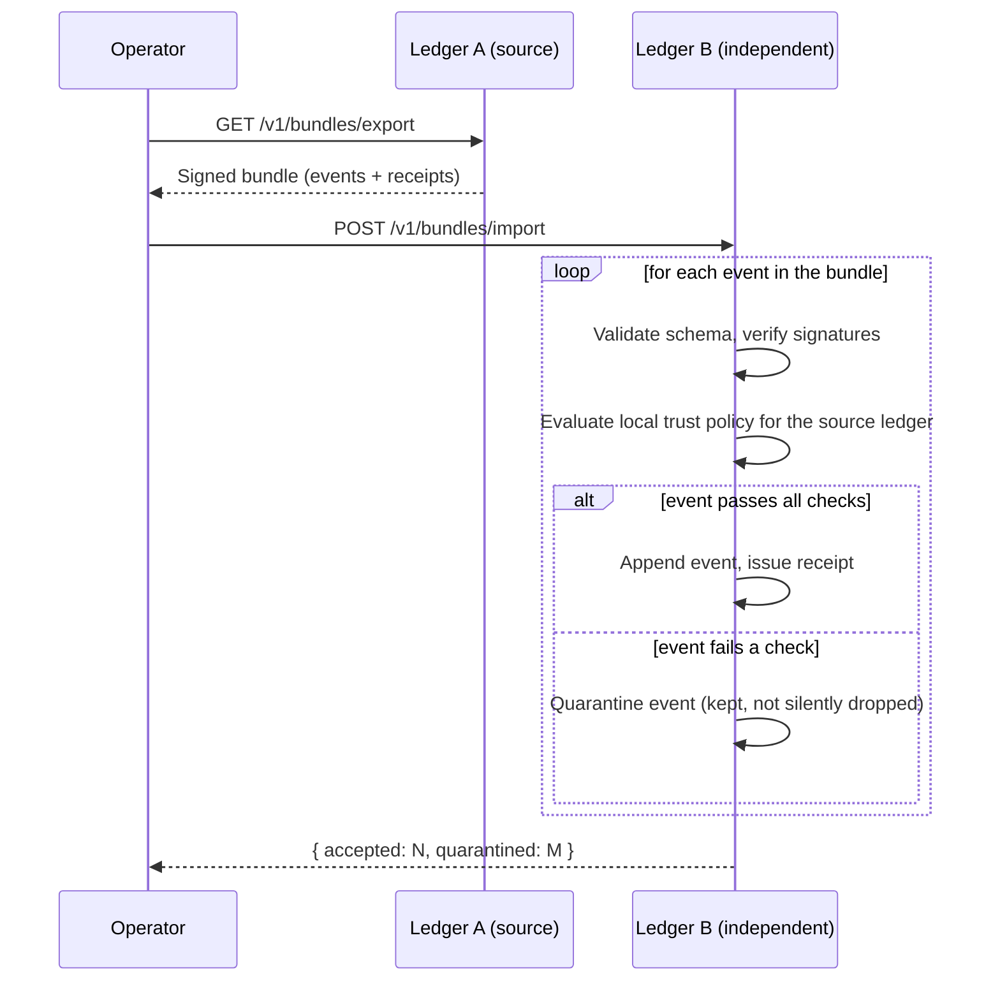

<p align="center">
  
</p>

<h1 align="center">ACT Protocol</h1>
<p align="center"><strong>Accountability and Chain of Transformation</strong></p>

<p align="center">
  <em>An open protocol for preserving meaning, provenance, evidence, and accountable<br/>
  decisions across human and AI collaboration.</em>
</p>

<p align="center">
  <a href="https://github.com/JGalego/ACT-protocol/actions/workflows/ci.yml"></a>
  <a href="LICENSE"></a>
  =22">
  
  
  
</p>

---

> Trust is earned through accountability. Accountability is enabled by transparency. Transparency is achieved through verifiable transformations.

ACT is a federated, content-addressed protocol, and a working reference implementation of it, for recording, evolving, and verifying the provenance of work produced when people, AI systems, and organizations collaborate. It covers intents and their revisions, the artifacts derived from them, the transformations that produced those artifacts, and the approvals, challenges, evidence, confidence, and uncertainty attached along the way.

ACT is **not** an agent framework or an orchestration engine. It's the protocol that agents, orchestrators, IDEs, code generators, CI/CD systems, and governance tools implement or consume.

Take any artifact ACT manages and you can mechanically work out what it is: its immutable identity and version, the events that produced it, who was behind each one and with what cryptographic identity, which policies and approvals applied, what assumptions and uncertainties were recorded along the way, what evidence backs it up, and whether the whole chain of hashes, signatures, receipts, and lineage actually verifies.

## Status

This is a **1.0.0 release candidate**. It is a genuine, non-fabricated vertical slice through the full protocol: everything listed under "What's Built" below is implemented and tested end-to-end, not stubbed. Everything under "What's Deferred" is explicitly out of scope for this release. See `docs/roadmap.md` and [`docs/adr/0001-phase-1-scope-and-deferred-work.md`](docs/adr/0001-phase-1-scope-and-deferred-work.md) for why, and what implementing it next would require.

## Quick Start

Prerequisites: **Node.js 22 LTS** and **pnpm 9+** (`corepack enable`).

```bash
git clone <this-repository>
cd act-protocol
pnpm install

# Regenerate the artifact-type schemas and their TypeScript types
# (already committed, but this is how you'd regenerate them):
pnpm run generate:artifact-types
pnpm run generate:types

# Run every offline quality gate: formatting, linting, strict type
# checking, schema fixture validation, and the full test suite.
make verify
```

Run the animated protocol demonstration:

```bash
pnpm run dev:explorer
# -> ACT Explorer at http://localhost:4173
```

The seeded walkthrough animates a complete accountable chain: human intent, an AI proposal, a requirements transformation, a scoped approval, implementation, tests, a semantic drift finding, a human challenge, a revision, and a runtime observation. Use play/pause, step controls, arrow keys, or the timeline scrubber. Select any record to inspect its rationale, assumptions, uncertainty, evidence, lineage, confidence, and envelope content. The **Data source** control can also load ordered signed envelopes from a running ACT `/v1/events` endpoint. Seeded identities and digests are visibly marked as non-production demonstration data.

Start the reference API service (SQLite-backed, local development mode):

```bash
ACT_DEV_MODE=true pnpm --filter @act/api run dev
# -> Fastify listening on :4000; see services/api/openapi/act-v1.yaml
```

Use the `act` CLI against a local embedded workspace:

```bash
cd /somewhere/else
node <path-to-repo>/apps/cli/dist/bin/act.js init --json
node <path-to-repo>/apps/cli/dist/bin/act.js intent create "Ship the thing" --json
node <path-to-repo>/apps/cli/dist/bin/act.js verify --json
```

(Once published, this will just be `npm install -g @act/cli && act init`.)

## Architecture Overview

```text
spec/            Normative ACT 1.0 specification (protocol, semantic model,
                  state machines, federation, conformance profiles)
schemas/          JSON Schema 2020-12 for every wire format: events, the
                  DSSE signed envelope, ledger receipts, all 28 artifact
                  types, policies, approvals, challenges, federation bundles,
                  each with positive and negative fixtures
packages/
  core/           RFC 8785 canonicalization, SHA-256 digests, UUIDv7 ids,
                  Ajv-based strict validation, schema-generated TS types
  crypto/         Ed25519 keys, DSSE envelope sign/verify, key lifecycle
  ledger/         SQLite-backed, hash-chained, atomic-write-path ledger:
                  cycle detection, idempotency, bounded lineage traversal,
                  quarantine
  policy/         Deterministic approval-requirement and authority-selection
                  evaluation, quorum, separation of duties
  verification/   Integrity/lineage/approval checks; all three required
                  semantic assessors (structural, AI, human)
  sdk-typescript/ Ergonomic, retrying HTTP client and event builder
services/
  api/            Fastify HTTP service implementing a working /v1 slice,
                  with an OpenAPI 3.1 contract and RFC 9457 errors
apps/
  cli/            The `act` command-line tool, operating against a local
                  embedded SQLite workspace
  explorer/       React/Cytoscape animated protocol demonstration and live
                  ledger event viewer, with desktop/mobile browser tests
sdks/
  python/         act-sdk: canonicalization, digests, ids, Ed25519/DSSE,
                  key lifecycle, an event builder, and a retrying HTTP
                  client, ported byte-for-byte from packages/core and
                  packages/crypto, verified against conformance/vectors/
conformance/      Frozen cross-SDK vectors and the profile-aware
                  conformance report generator (spec/conformance.md)
deploy/           Dockerfiles, a full Docker Compose stack, and a Helm
                  chart with secure defaults (docs/deployment.md)
examples/         Five seeded example applications (product team, competing
                  AI proposals, enterprise OIDC/quorum, open-source
                  federation, safety-critical challenge), each a real
                  signed-envelope sequence against a real services/api
docs/             Guides, threat model, versioning, roadmap, ADRs
```

Every package builds independently (`pnpm --filter <name> run build`) and ships its own test suite; `packages/core`, `packages/crypto`, `packages/ledger`, `packages/policy`, and `packages/verification` maintain ≥90% branch coverage, the rest ≥80% (`docs/testing-strategy.md`).

## How a Transformation Actually Flows

It starts with a client, either the CLI or anything built on `packages/sdk-typescript`, building an unsigned event and signing it with an Ed25519 key held locally. The signed envelope goes to `services/api`. The server itself never signs anything on a caller's behalf; it only ever verifies what arrives.

That verification is where the real gatekeeping happens. `services/api` validates the envelope's schema, recomputes its digest, checks every attached signature, evaluates trust policy, confirms the causal parents are known, and rejects the write outright if it would create a lineage cycle. Only once all of that passes does it append the event and issue a hash-chained receipt through `packages/ledger`. That's the full nine-step write path from `spec/ACT-1.0.md` section 6.1, traced below.

A receipt being issued isn't the end of the story, though. `packages/verification` can independently re-check integrity, lineage completeness, and approval validity at any later point, and what it produces is an explained, attributable finding rather than a single collapsed "valid" boolean. Whether a transformation needed approval in the first place, and under what quorum, was never a flag someone flipped by hand either. `packages/policy` decides that purely as a function of the current policy version and the request itself.

`services/api/src/__tests__/server.test.ts` is the canonical worked example, and it runs against the real handlers with no mocks: registering a key and an actor, submitting an Intent, recording a two-input Transformation, running a full cycle from approval request through decision, challenge, and verification, and finally exporting and importing a signed bundle into a second, independent ledger.

### Submitting a signed event: the nine-step write path

Every write, whether it's an Intent, a Transformation, an Approval, a Challenge, a Verification, or a Policy, goes through this same atomic path (`spec/ACT-1.0.md` §6.1). If any of the first six steps fails, no receipt is issued and no projection is updated.



### What happens after: approval, challenge, and verification

Getting a transformation onto the ledger is only the start of its life. Whether it needs approval, and under what quorum, stays a policy **evaluation** rather than a mutable flag on the record. Any accepted event can later be challenged by any party, and any event can be independently re-verified at any time, which is what the sequence below traces.



### Sharing history across ledgers: federated bundle transfer

Ledgers never share a database with each other. When one operator wants to give another their history, that handoff is always an explicit, signed bundle transfer, and the importing ledger re-verifies everything against its own trust policy rather than trusting the exporter. An event that fails a check doesn't just vanish, either. It's quarantined: kept on record and flagged, never silently dropped.



## What's Built

- The full normative ACT 1.0 specification and semantic model (`spec/`)
- 46 JSON Schemas with positive/negative fixtures, all passing
- Canonicalization, digests, ids, and validation (`packages/core`)
- Ed25519 signing, DSSE envelopes, key lifecycle (`packages/crypto`)
- A hash-chained ledger with cycle detection and quarantine, over either SQLite or PostgreSQL behind one `StorageAdapter` contract (`packages/ledger`, ADR 0008)
- Deterministic policy/quorum/authority evaluation (`packages/policy`)
- Integrity, lineage, and approval verification, plus all three required semantic assessors: deterministic structural, provider-neutral OpenAI-compatible (with a deterministic local emulator so it's testable without a paid service), and human (`packages/verification`)
- Real peer-to-peer federation transport between independently-hosted ledgers, with informational fork detection and adversarial equivocation detection (`services/api/src/routes/federation.ts`, `spec/federation.md`)
- A machine-checked formal model: seven TLA+ modules matching every state machine in `spec/state-machines.md`, verified with a real TLC run (`formal/`, `make verify-formal`)
- Production OIDC/JWT bearer-token validation (JWKS signature/issuer/audience/expiry checks via `jose`), backed by a deterministic local OIDC provider for offline testing (`services/api/src/oidc/`, ADR 0006)
- A profile-aware conformance report generator over frozen, generated vectors, verified bidirectionally between SDKs: Core, Cryptographic Integrity, Federation, and SDK profiles CLAIMED (`conformance/`, `spec/conformance.md`)
- TypeScript and Python SDKs (`packages/sdk-typescript`, `sdks/python`), both checked against the same `conformance/vectors/` so they can never silently drift from each other
- A working `/v1` API slice with OpenAPI 3.1 and RFC 9457 errors, including event search/filter, a challenges list, and artifact version-diff (`services/api`)
- The `act` CLI against a local embedded workspace (`apps/cli`)
- An animated ACT Explorer demonstration with playback, timeline scrubbing, evidence inspection, intent-drift visualization, a repository-wide Confidence Heatmap view, and an optional live `/v1/events` data source (`apps/explorer`)
- Hardened non-root Dockerfiles, a full Docker Compose stack (API + PostgreSQL + Explorer + a real OpenTelemetry Collector + the local OIDC dev provider), and a Helm chart with secure defaults, `NetworkPolicy`, `PodDisruptionBudget`, and a pre-install migration Job (`deploy/`, `docs/deployment.md`)
- All six seeded example applications from `PROMPT.md`'s Example Applications section: the animated human+AI walkthrough (`apps/explorer`) plus a product-team workflow, competing AI proposals, an enterprise OIDC/quorum workflow, open-source federation, and a safety-critical workflow with an unresolved challenge (`examples/`), each a real signed-envelope sequence against a real `services/api` instance with assertions proving the outcome
- 404 unit/integration tests (359 TypeScript, 45 Python) plus 7 desktop/mobile browser tests, `make verify` green from a clean checkout, zero known dependency vulnerabilities (`docs/dependency-audit.md`)

## What's Deferred

Go and Rust SDKs, the full operational ACT Explorer conformance profile beyond the implemented animated lineage demo and Confidence Heatmap view, a standalone demo-data seed command, and organizational admission control for key registration. Every item is listed with rationale and a concrete starting point in [`docs/roadmap.md`](docs/roadmap.md).

## Documentation

- [`spec/ACT-1.0.md`](spec/ACT-1.0.md): the normative specification
- [`spec/semantic-model.md`](spec/semantic-model.md), [`spec/state-machines.md`](spec/state-machines.md), [`spec/federation.md`](spec/federation.md), [`spec/conformance.md`](spec/conformance.md)
- [`docs/api-reference.md`](docs/api-reference.md) and [`services/api/openapi/act-v1.yaml`](services/api/openapi/act-v1.yaml)
- [`docs/security-and-privacy-guide.md`](docs/security-and-privacy-guide.md) and [`docs/threat-model.md`](docs/threat-model.md)
- [`docs/versioning.md`](docs/versioning.md), [`docs/testing-strategy.md`](docs/testing-strategy.md), [`docs/standards-adoption.md`](docs/standards-adoption.md)
- [`docs/adr/`](docs/adr/): every non-obvious design decision, with rationale
- [`CONTRIBUTING.md`](CONTRIBUTING.md) and [`GOVERNANCE.md`](GOVERNANCE.md)

## License

[Apache License 2.0](LICENSE).
