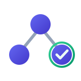

<p align="center">
  
</p>

<h1 align="center">ACT Protocol</h1>
<p align="center"><strong>Accountability and Chain of Transformation</strong></p>

<p align="center">
  <em>An open protocol for preserving meaning, provenance, evidence, and accountable<br/>
  decisions across human and AI collaboration.</em>
</p>

<p align="center">
  <a href="https://github.com/JGalego/ACT-protocol/actions/workflows/ci.yml"></a>
  <a href="LICENSE"></a>
  =22">
  
  
  
</p>

---

> Trust is earned through accountability.
> Accountability is enabled by transparency.
> Transparency is achieved through verifiable transformations.

ACT is a federated, content-addressed protocol — and a working reference
implementation — for recording, evolving, and verifying the provenance of
work produced by people, AI systems, and organizations collaborating
together: intents and their revisions, the artifacts derived from them,
the transformations that produced those artifacts, and the approvals,
challenges, evidence, confidence, and uncertainty attached along the way.

ACT is **not** an agent framework or an orchestration engine. It is the
protocol that agents, orchestrators, IDEs, code generators, CI/CD systems,
and governance tools implement or consume.

For any artifact ACT manages, it makes it possible to determine
mechanically: its immutable identity and version, the events that produced
it, the actors and cryptographic identities behind each event, the
applicable policies and approvals, the assumptions and uncertainties
recorded, the evidence attached, and whether the whole chain — hashes,
signatures, receipts, lineage — verifies.

## Status

This is a **1.0.0 release candidate**. It is a genuine, non-fabricated
vertical slice through the full protocol: everything listed under
"What's Built" below is implemented and tested end-to-end, not stubbed.
Everything under "What's Deferred" is explicitly out of scope for this
release — see `docs/roadmap.md` and
[`docs/adr/0001-phase-1-scope-and-deferred-work.md`](docs/adr/0001-phase-1-scope-and-deferred-work.md)
for why, and what implementing it next would require.

## Quick Start

Prerequisites: **Node.js 22 LTS** and **pnpm 9+** (`corepack enable`).

```bash
git clone <this-repository>
cd act-protocol
pnpm install

# Regenerate the artifact-type schemas and their TypeScript types
# (already committed, but this is how you'd regenerate them):
pnpm run generate:artifact-types
pnpm run generate:types

# Run every offline quality gate: formatting, linting, strict type
# checking, schema fixture validation, and the full test suite.
make verify
```

Start the reference API service (SQLite-backed, local development mode):

```bash
ACT_DEV_MODE=true pnpm --filter @act/api run dev
# -> Fastify listening on :4000; see services/api/openapi/act-v1.yaml
```

Use the `act` CLI against a local embedded workspace:

```bash
cd /somewhere/else
node <path-to-repo>/apps/cli/dist/bin/act.js init --json
node <path-to-repo>/apps/cli/dist/bin/act.js intent create "Ship the thing" --json
node <path-to-repo>/apps/cli/dist/bin/act.js verify --json
```

(Once published, this will just be `npm install -g @act/cli && act init`.)

## Architecture Overview

```text
spec/            Normative ACT 1.0 specification (protocol, semantic model,
                  state machines, federation, conformance profiles)
schemas/          JSON Schema 2020-12 for every wire format: events, the
                  DSSE signed envelope, ledger receipts, all 28 artifact
                  types, policies, approvals, challenges, federation bundles
                  — with positive and negative fixtures for each
packages/
  core/           RFC 8785 canonicalization, SHA-256 digests, UUIDv7 ids,
                  Ajv-based strict validation, schema-generated TS types
  crypto/         Ed25519 keys, DSSE envelope sign/verify, key lifecycle
  ledger/         SQLite-backed, hash-chained, atomic-write-path ledger:
                  cycle detection, idempotency, bounded lineage traversal,
                  quarantine
  policy/         Deterministic approval-requirement and authority-selection
                  evaluation, quorum, separation of duties
  verification/   Integrity/lineage/approval checks; all three required
                  semantic assessors (structural, AI, human)
  sdk-typescript/ Ergonomic, retrying HTTP client and event builder
services/
  api/            Fastify HTTP service implementing a working /v1 slice,
                  with an OpenAPI 3.1 contract and RFC 9457 errors
apps/
  cli/            The `act` command-line tool, operating against a local
                  embedded SQLite workspace
docs/             Guides, threat model, versioning, roadmap, ADRs
```

Every package builds independently (`pnpm --filter <name> run build`) and
ships its own test suite; `packages/core`, `packages/crypto`,
`packages/ledger`, `packages/policy`, and `packages/verification` maintain
≥90% branch coverage, the rest ≥80% (`docs/testing-strategy.md`).

## How a Transformation Actually Flows

1. A client (the CLI or any `packages/sdk-typescript` consumer) builds an
   unsigned event, signs it with an Ed25519 key it holds locally, and
   submits the signed envelope — the server never signs on a caller's
   behalf.
2. `services/api` validates the envelope's schema, recomputes its digest,
   verifies every attached signature, evaluates trust policy, checks
   causal parents, rejects lineage cycles, and only then appends the
   event and issues a hash-chained receipt (`packages/ledger`) — the
   exact 9-step write path from `spec/ACT-1.0.md` section 6.1.
3. `packages/verification` can independently re-check integrity
   (digest/signature/receipt-chain), lineage completeness, and approval
   validity at any time, producing explained, attributable findings —
   never a single collapsed "valid" boolean.
4. `packages/policy` decides whether a given transformation requires
   approval, and under what quorum, purely as a function of the current
   policy version and the request — never a mutable flag on the subject.

`services/api/src/__tests__/server.test.ts` is the canonical worked
example: it registers a key and actor, submits an Intent, records a
two-input Transformation, runs a full approval-request → decision →
challenge → verification → policy cycle, and exports/imports a signed
bundle into a second, independent ledger — against the real handlers, no
mocks.

## What's Built

- The full normative ACT 1.0 specification and semantic model (`spec/`)
- 46 JSON Schemas with positive/negative fixtures, all passing
- Canonicalization, digests, ids, and validation (`packages/core`)
- Ed25519 signing, DSSE envelopes, key lifecycle (`packages/crypto`)
- A SQLite-backed hash-chained ledger with cycle detection and quarantine
  (`packages/ledger`)
- Deterministic policy/quorum/authority evaluation (`packages/policy`)
- Integrity, lineage, and approval verification, plus all three required
  semantic assessors — deterministic structural, provider-neutral
  OpenAI-compatible (with a deterministic local emulator so it's testable
  without a paid service), and human (`packages/verification`)
- A TypeScript SDK (`packages/sdk-typescript`)
- A working `/v1` API slice with OpenAPI 3.1 and RFC 9457 errors
  (`services/api`)
- The `act` CLI against a local embedded workspace (`apps/cli`)
- 215 tests, `make verify` green from a clean checkout, zero known
  dependency vulnerabilities (`docs/dependency-audit.md`)

## What's Deferred

PostgreSQL adapter, multi-ledger federation transport, Python/Go/Rust
SDKs, ACT Explorer, the machine-checked formal model, Docker/Helm
deployment, production OIDC/JWT auth, and the six seeded example
applications. Every item is listed with rationale and a concrete starting
point in [`docs/roadmap.md`](docs/roadmap.md).

## Documentation

- [`spec/ACT-1.0.md`](spec/ACT-1.0.md) — the normative specification
- [`spec/semantic-model.md`](spec/semantic-model.md),
  [`spec/state-machines.md`](spec/state-machines.md),
  [`spec/federation.md`](spec/federation.md),
  [`spec/conformance.md`](spec/conformance.md)
- [`docs/api-reference.md`](docs/api-reference.md) and
  [`services/api/openapi/act-v1.yaml`](services/api/openapi/act-v1.yaml)
- [`docs/security-and-privacy-guide.md`](docs/security-and-privacy-guide.md)
  and [`docs/threat-model.md`](docs/threat-model.md)
- [`docs/versioning.md`](docs/versioning.md),
  [`docs/testing-strategy.md`](docs/testing-strategy.md),
  [`docs/standards-adoption.md`](docs/standards-adoption.md)
- [`docs/adr/`](docs/adr/) — every non-obvious design decision, with
  rationale
- [`CONTRIBUTING.md`](CONTRIBUTING.md) and [`GOVERNANCE.md`](GOVERNANCE.md)

## License

[Apache License 2.0](LICENSE).
