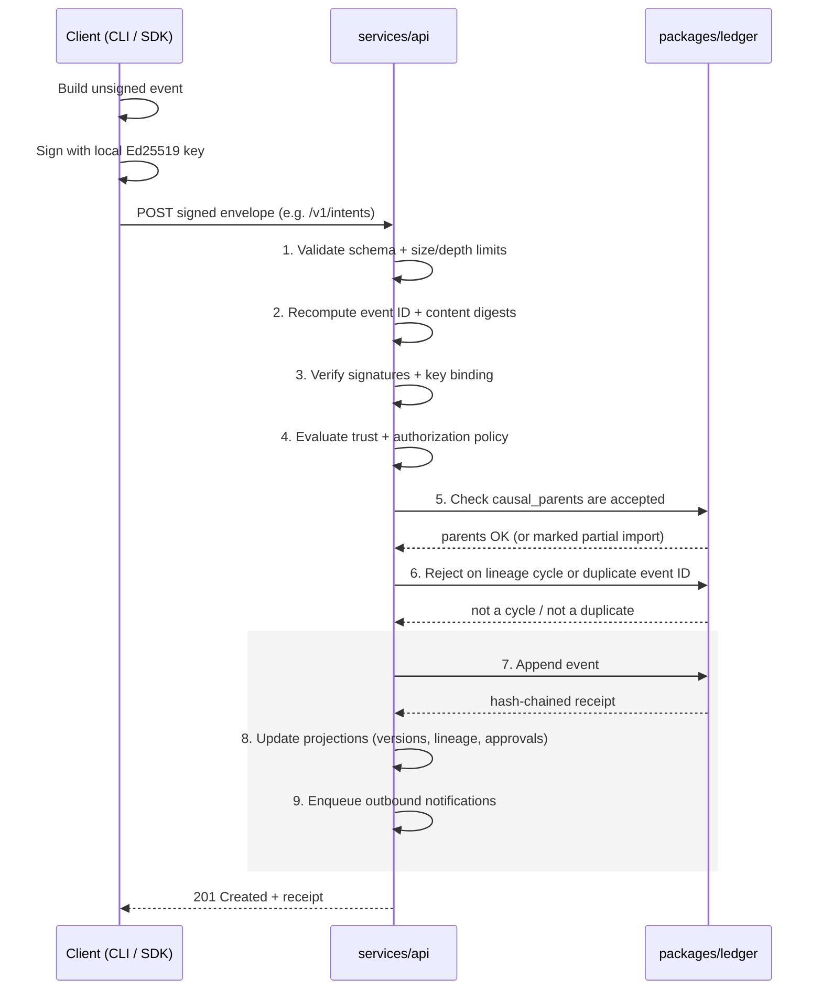
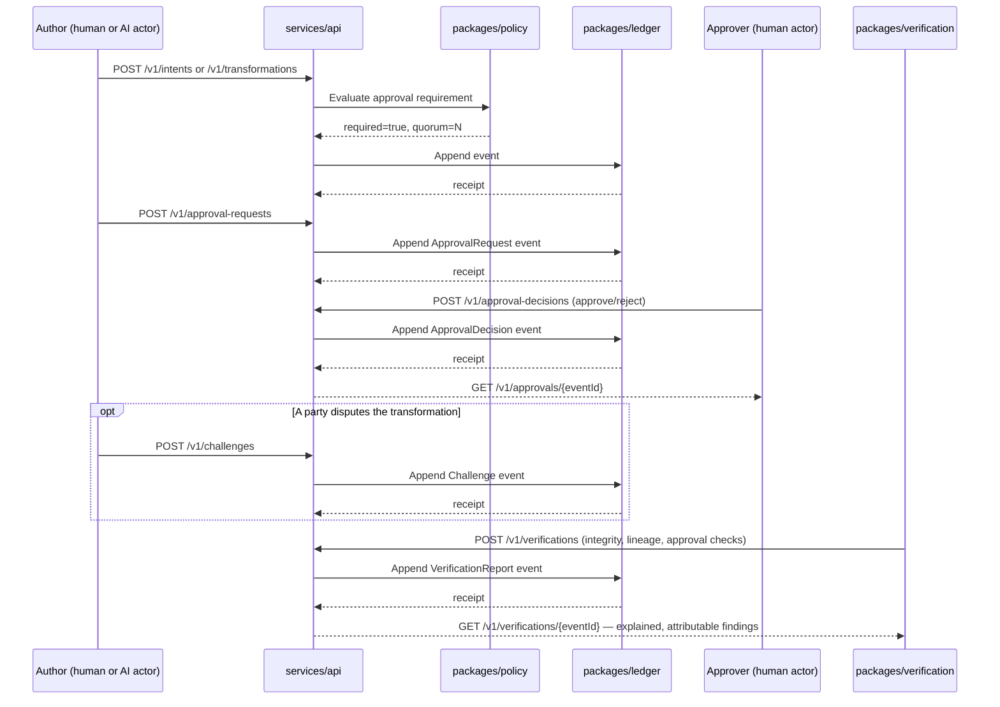
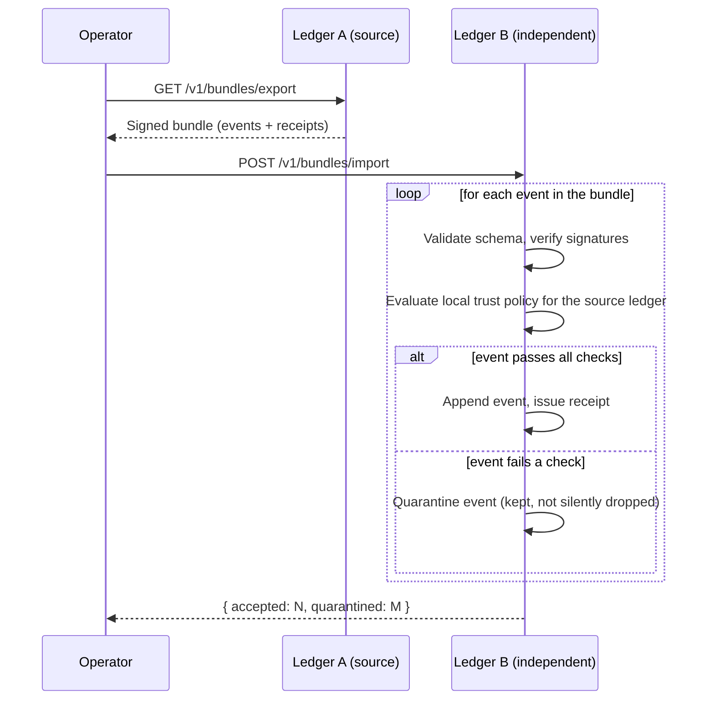

Everything below is animated end-to-end in the [live ACT Explorer](/explorer/) — a good companion to read this page alongside.

## Repository layout

```text
spec/            Normative ACT 1.0 specification (protocol, semantic model,
                  state machines, federation, conformance profiles)
schemas/          JSON Schema 2020-12 for every wire format: events, the
                  DSSE signed envelope, ledger receipts, all 28 artifact
                  types, policies, approvals, challenges, federation bundles
                  — with positive and negative fixtures for each
packages/
  core/           RFC 8785 canonicalization, SHA-256 digests, UUIDv7 ids,
                  Ajv-based strict validation, schema-generated TS types
  crypto/         Ed25519 keys, DSSE envelope sign/verify, key lifecycle
  ledger/         SQLite-backed, hash-chained, atomic-write-path ledger:
                  cycle detection, idempotency, bounded lineage traversal,
                  quarantine
  policy/         Deterministic approval-requirement and authority-selection
                  evaluation, quorum, separation of duties
  verification/   Integrity/lineage/approval checks; all three required
                  semantic assessors (structural, AI, human)
  sdk-typescript/ Ergonomic, retrying HTTP client and event builder
services/
  api/            Fastify HTTP service implementing a working /v1 slice,
                  with an OpenAPI 3.1 contract and RFC 9457 errors
apps/
  cli/            The `act` command-line tool, operating against a local
                  embedded SQLite workspace
  explorer/       React/Cytoscape animated protocol demonstration and live
                  ledger event viewer, with desktop/mobile browser tests
docs/             Guides, threat model, versioning, roadmap, ADRs
```

Every package builds independently (`pnpm --filter <name> run build`) and ships its own test suite; `packages/core`, `packages/crypto`, `packages/ledger`, `packages/policy`, and `packages/verification` maintain ≥90% branch coverage, the rest ≥80%.

## How a transformation actually flows

1. A client (the CLI or any `packages/sdk-typescript` consumer) builds an unsigned event, signs it with an Ed25519 key it holds locally, and submits the signed envelope — the server never signs on a caller's behalf.
2. `services/api` validates the envelope's schema, recomputes its digest, verifies every attached signature, evaluates trust policy, checks causal parents, rejects lineage cycles, and only then appends the event and issues a hash-chained receipt (`packages/ledger`) — the exact 9-step write path from `spec/ACT-1.0.md` section 6.1.
3. `packages/verification` can independently re-check integrity (digest/signature/receipt-chain), lineage completeness, and approval validity at any time, producing explained, attributable findings — never a single collapsed "valid" boolean.
4. `packages/policy` decides whether a given transformation requires approval, and under what quorum, purely as a function of the current policy version and the request — never a mutable flag on the subject.

`services/api/src/__tests__/server.test.ts` is the canonical worked example: it registers a key and actor, submits an Intent, records a two-input Transformation, runs a full approval-request → decision → challenge → verification → policy cycle, and exports/imports a signed bundle into a second, independent ledger — against the real handlers, no mocks.

### Submitting a signed event (the 9-step write path)

Every write — Intent, Transformation, Approval, Challenge, Verification, Policy — goes through the same atomic path (`spec/ACT-1.0.md` §6.1). If any of steps 1-6 fails, no receipt is issued and no projection is updated.



### Approval, challenge, and verification cycle

Whether a Transformation needs approval — and under what quorum — is a policy **evaluation**, never a mutable flag on the record. Any accepted event can later be challenged, and any event can be independently re-verified at any time.



### Federated bundle export and import

Ledgers are independent; sharing history is an explicit, signed bundle transfer, never a shared database. The importing ledger re-verifies everything against its own trust policy rather than trusting the exporter.


