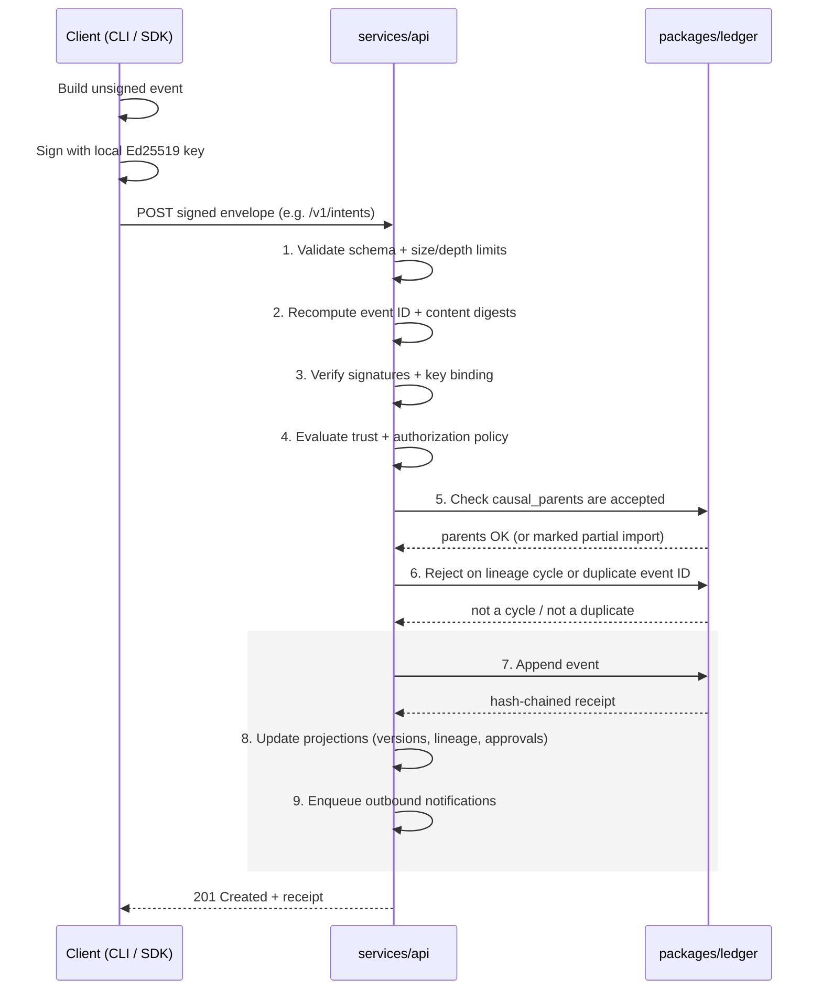
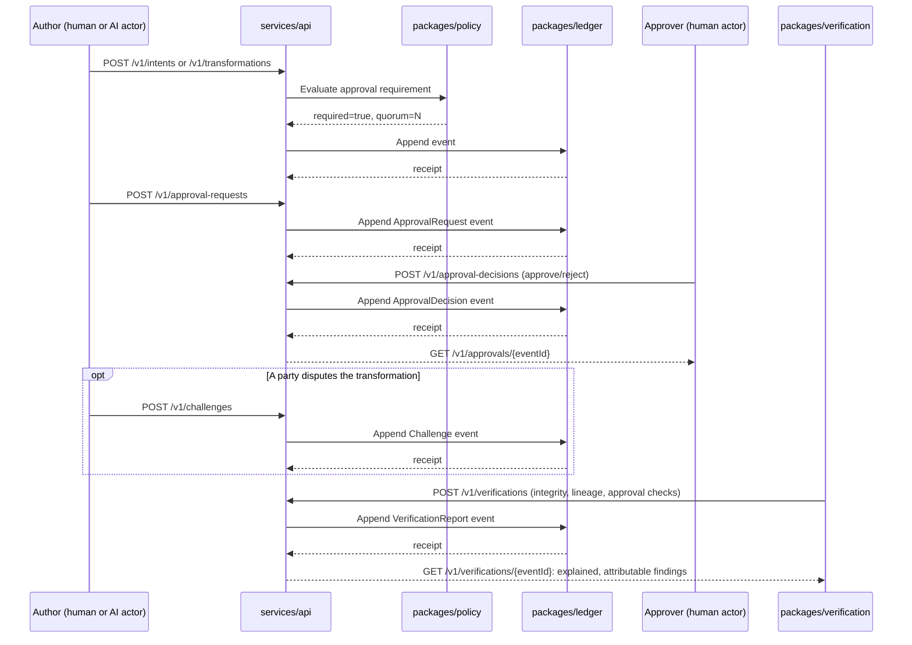
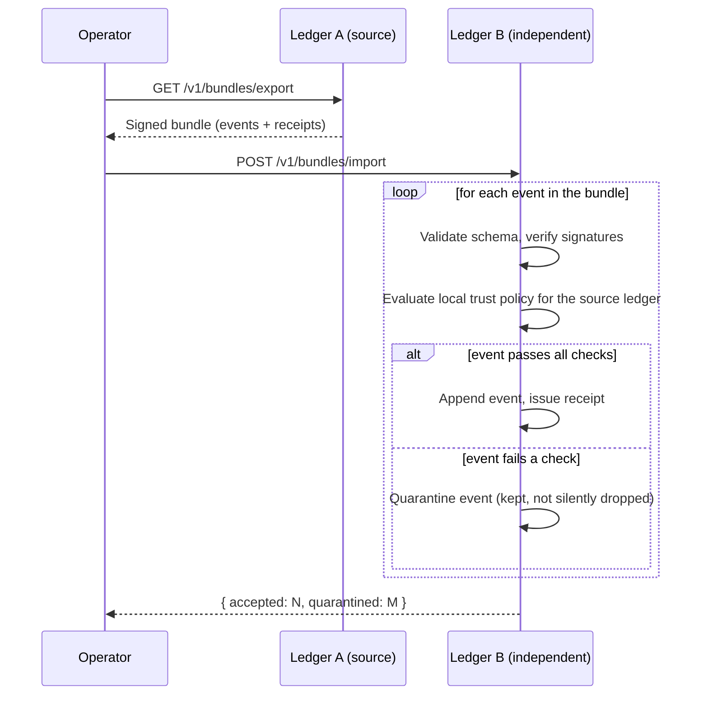

The best way to understand ACT is to follow one transformation from the moment a client signs it to the moment an independent verifier checks it. That's exactly what the [live ACT Explorer](/explorer/) animates end to end, so it's worth keeping open alongside this page.

## Repository layout

Before tracing that path, here's where everything lives:

```text
spec/            Normative ACT 1.0 specification (protocol, semantic model,
                  state machines, federation, conformance profiles)
schemas/          JSON Schema 2020-12 for every wire format: events, the
                  DSSE signed envelope, ledger receipts, all 28 artifact
                  types, policies, approvals, challenges, federation bundles,
                  with positive and negative fixtures for each
packages/
  core/           RFC 8785 canonicalization, SHA-256 digests, UUIDv7 ids,
                  Ajv-based strict validation, schema-generated TS types
  crypto/         Ed25519 keys, DSSE envelope sign/verify, key lifecycle
  ledger/         SQLite-backed, hash-chained, atomic-write-path ledger:
                  cycle detection, idempotency, bounded lineage traversal,
                  quarantine
  policy/         Deterministic approval-requirement and authority-selection
                  evaluation, quorum, separation of duties
  verification/   Integrity/lineage/approval checks; all three required
                  semantic assessors (structural, AI, human)
  sdk-typescript/ Ergonomic, retrying HTTP client and event builder
services/
  api/            Fastify HTTP service implementing a working /v1 slice,
                  with an OpenAPI 3.1 contract and RFC 9457 errors
apps/
  cli/            The `act` command-line tool, operating against a local
                  embedded SQLite workspace
  explorer/       React/Cytoscape animated protocol demonstration and live
                  ledger event viewer, with desktop/mobile browser tests
docs/             Guides, threat model, versioning, roadmap, ADRs
```

Every package builds independently (`pnpm --filter <name> run build`) and ships its own test suite. `packages/core`, `packages/crypto`, `packages/ledger`, `packages/policy`, and `packages/verification` hold at least 90% branch coverage; everything else holds at least 80%.

## Following a transformation through the system

It starts with a client, either the CLI or anything built on `packages/sdk-typescript`, building an unsigned event and signing it with an Ed25519 key held locally. The signed envelope goes to `services/api`. The server itself never signs anything on a caller's behalf; it only ever verifies what arrives.

That verification is where the real gatekeeping happens. `services/api` validates the envelope's schema, recomputes its digest, checks every attached signature, evaluates trust policy, confirms the causal parents are known, and rejects the write outright if it would create a lineage cycle. Only once all of that passes does it append the event and issue a hash-chained receipt through `packages/ledger`. That's the full nine-step write path from `spec/ACT-1.0.md` section 6.1, traced below.

A receipt being issued isn't the end of the story, though. `packages/verification` can independently re-check integrity, lineage completeness, and approval validity at any later point, and what it produces is an explained, attributable finding rather than a single collapsed "valid" boolean. Whether a transformation needed approval in the first place, and under what quorum, was never a flag someone flipped by hand either. `packages/policy` decides that purely as a function of the current policy version and the request itself.

`services/api/src/__tests__/server.test.ts` is the canonical worked example, and it runs against the real handlers with no mocks: registering a key and an actor, submitting an Intent, recording a two-input Transformation, running a full cycle from approval request through decision, challenge, and verification, and finally exporting and importing a signed bundle into a second, independent ledger.

### Submitting a signed event: the nine-step write path

Every write, whether it's an Intent, a Transformation, an Approval, a Challenge, a Verification, or a Policy, goes through this same atomic path. If any of the first six steps fails, no receipt is issued and no projection is updated.



### What happens after: approval, challenge, and verification

Getting a transformation onto the ledger is only the start of its life. Whether it needs approval, and under what quorum, stays a policy evaluation rather than a mutable flag on the record. Any accepted event can later be challenged by any party, and any event can be independently re-verified at any time, which is what the sequence below traces.



### Sharing history across ledgers: federated bundle transfer

Ledgers never share a database with each other. When one operator wants to give another their history, that handoff is always an explicit, signed bundle transfer, and the importing ledger re-verifies everything against its own trust policy rather than trusting the exporter. An event that fails a check doesn't just vanish, either. It's quarantined: kept on record and flagged, never silently dropped.


