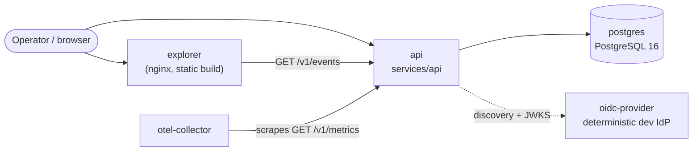

Two deployment shapes exist under `deploy/`, both built from the same hardened, non-root, multi-stage Dockerfiles (`deploy/docker/api.Dockerfile`, `deploy/docker/explorer.Dockerfile`):

- **`deploy/compose/`**: a full local/demo stack via Docker Compose.
- **`deploy/helm/act/`**: a Helm chart for a production-shaped Kubernetes deployment.

## Local stack topology

```bash
docker compose -f deploy/compose/docker-compose.yml up --build
```



Everything here is for local and demo use: fixed development-only credentials, and the OIDC provider mints tokens on request with no real login flow.

| Service | Purpose |
| --- | --- |
| `postgres` | PostgreSQL 16, the API's storage backend |
| `oidc-provider` | A deterministic, offline OIDC issuer (discovery, JWKS, token endpoint) that exercises the API's production OIDC/JWT path without a paid identity provider |
| `api` | `services/api`, `ACT_STORAGE=postgres`, pointed at both of the above |
| `explorer` | The static Vite build of `apps/explorer`, served by nginx |
| `otel-collector` | Scrapes the API's real `GET /v1/metrics` (Prometheus text format) and logs what it collected. A genuinely functioning pipeline, not a placeholder |

:::tip[Exercising OIDC without a paid identity provider]

The `oidc-provider` service is a real, deterministic OIDC issuer, not a mock. Point `ACT_OIDC_ISSUER` at it and the API's production JWT-validation path runs exactly as it would against Okta, Auth0, or Entra ID.

:::

## Environment reference

| Variable | Default | Meaning |
| --- | --- | --- |
| `NODE_ENV` | `development` | `production` triggers the fail-closed auth check below |
| `PORT` | `4000` | HTTP port |
| `ACT_STORAGE` | `sqlite` | `sqlite` or `postgres` |
| `ACT_DB_PATH` | `./data/act.db` | SQLite file path (ignored when `ACT_STORAGE=postgres`) |
| `ACT_DATABASE_URL` | — | Required when `ACT_STORAGE=postgres` |
| `ACT_DEV_MODE` | `false` | Enables the local bearer-as-actor-id auth scheme. **Must** be `false` or unset in production; the server refuses to start otherwise |
| `ACT_OIDC_ISSUER` / `ACT_OIDC_AUDIENCE` | — | Required in production (mutually exclusive with `ACT_DEV_MODE`) |
| `ACT_OIDC_JWKS_URI` | discovered from `ACT_OIDC_ISSUER` | Set to skip OIDC discovery |

`NODE_ENV=production` fails closed at startup unless exactly one of `ACT_DEV_MODE=true` (never in production) or both OIDC variables are set.

## Migrations

`services/api`'s `createLedgerContext` applies pending migrations idempotently on every boot, so no separate step is strictly required. A standalone entrypoint (`pnpm --filter @act/api run migrate`) also exists, so a Helm pre-install or pre-upgrade Job can apply migrations once before any API replica rolls out, rather than relying on whichever replica boots first.

## Helm chart

```bash
helm install act deploy/helm/act \
  --set image.repository=<your-registry>/act-api \
  --set existingSecret=act-db-credentials
```

Secure defaults come out of the box: non-root, read-only root filesystem, dropped capabilities, a `NetworkPolicy`, a `PodDisruptionBudget`, a pre-install migration Job, and an `existingSecret` pattern for the database connection string. No connection string ever lives in a `values.yaml` or a ConfigMap.

## Verifying without a Docker daemon or live cluster

```bash
make verify-deploy
```

This statically validates everything above: `helm lint` and `helm template`, plus `kubeconform` schema validation and `hadolint` Dockerfile linting, all without needing Docker or Kubernetes. CI's `deploy-lint` job additionally runs a real `docker compose ... config` check.

:::note[Why this repo's own sandbox can't run it end-to-end]

This development environment has no usable Docker daemon (WSL2 without the Docker Desktop integration enabled), so the Compose stack and Dockerfiles are statically validated here but not actually built or run in this specific sandbox. CI's `deploy-lint` job, and `make verify-integration`'s real dockerized PostgreSQL run, are the actual proof. See `scripts/integration-smoke.ts` for the exact HTTP smoke sequence it exercises against a real, containerized `services/api`.

:::
