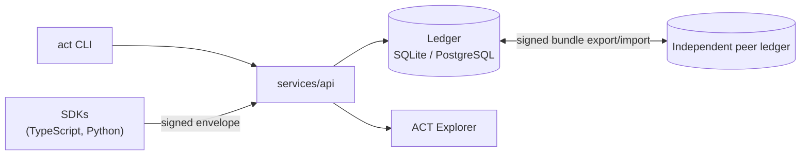

import { Card, CardGrid } from '@astrojs/starlight/components';

> Trust is earned through accountability. Accountability is enabled by transparency. Transparency is achieved through verifiable transformations.

For any artifact ACT manages, it makes it possible to determine mechanically: its immutable identity and version, the events that produced it, the actors and cryptographic identities behind each event, the applicable policies and approvals, the assumptions and uncertainties recorded, the evidence attached, and whether the whole chain — hashes, signatures, receipts, lineage — verifies.

## What ACT gives you

<CardGrid stagger>
  <Card title="Cryptographic Provenance" icon="padlock">
    Every Intent, Transformation, Approval, Challenge, and Verification is a signed event,
    Ed25519-signed by the actor who made it and chained into a hash-linked ledger receipt — not a
    mutable database row.
  </Card>
  <Card title="Accountable Transformations" icon="pencil">
    Every transformation carries its mode, semantic-change classification, assumptions,
    alternatives, rationale, confidence, and evidence as an attributed claim — never a silent diff.
  </Card>
  <Card title="Policy-Driven Approval" icon="approve-check">
    Whether a change needs approval, and under what quorum, is a deterministic policy evaluation
    against the current policy version — never a mutable flag on the record.
  </Card>
  <Card title="Independent Verification" icon="magnifier">
    Integrity, lineage, and approval validity can be independently re-checked at any time, producing
    explained, attributable findings instead of a single collapsed "valid" boolean.
  </Card>
  <Card title="Federated by Design" icon="random">
    Ledgers are independent. Sharing history is an explicit, signed bundle export/import,
    re-verified against the importing ledger's own trust policy — never a shared database.
  </Card>
  <Card title="Not an Agent Framework" icon="information">
    ACT is the protocol that agents, orchestrators, IDEs, code generators, CI/CD systems, and
    governance tools implement or consume — not another one of them.
  </Card>
</CardGrid>

## How the pieces fit together

Clients sign locally and submit signed envelopes; the API verifies, evaluates policy, and appends to a hash-chained ledger — it never signs on a caller's behalf. Ledgers stay independent; sharing history between them is always an explicit, re-verified bundle transfer. See [Architecture](/architecture/) for the full write path.

## See it work

The seeded [ACT Explorer](/explorer/) walkthrough animates a complete accountable chain: human intent → AI proposal → requirements transformation → scoped approval → implementation → tests → semantic drift finding → human challenge → revision → runtime observation. Use play/pause, step controls, or the timeline scrubber; select records to inspect rationale, assumptions, evidence, lineage, and confidence.

:::tip[Six more scenarios] The Explorer's walkthrough is one of six seeded, assertion-backed examples — see [Examples](/examples/) for enterprise quorum approval, competing AI proposals, cross-ledger federation, and more. :::

## Status

This is a **1.0.0 release candidate** — a genuine, non-fabricated vertical slice through the full protocol. See the [Roadmap](/roadmap/) for what's built and deferred and why, or [Design Decisions](/design-decisions/) for the history behind the non-obvious choices.
