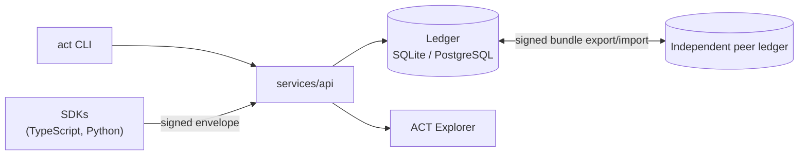

import { Card, CardGrid } from '@astrojs/starlight/components';

> Trust is earned through accountability. Accountability is enabled by transparency. Transparency is achieved through verifiable transformations.

Take any artifact ACT manages and you can mechanically work out what it is: its immutable identity and version, the events that produced it, who was behind each one and with what cryptographic identity, which policies and approvals applied, what assumptions and uncertainties were recorded along the way, what evidence backs it up, and whether the whole chain of hashes, signatures, receipts, and lineage actually verifies.

## What ACT gives you

<CardGrid stagger>
  <Card title="Cryptographic Provenance" icon="padlock">
    Every Intent, Transformation, Approval, Challenge, and Verification is a signed event. Each one
    is Ed25519-signed by the actor who made it and chained into a hash-linked ledger receipt, not a
    mutable database row.
  </Card>
  <Card title="Accountable Transformations" icon="pencil">
    Every transformation carries its mode, its semantic-change classification, and the assumptions
    and rationale behind it as an attributed claim. It's never a silent diff.
  </Card>
  <Card title="Policy-Driven Approval" icon="approve-check">
    Whether a change needs approval, and under what quorum, is a deterministic policy evaluation
    against the current policy version. It's never a mutable flag on the record.
  </Card>
  <Card title="Independent Verification" icon="magnifier">
    Integrity, lineage, and approval validity can all be independently re-checked at any time. What
    comes back is an explained, attributable finding, not a single collapsed "valid" boolean.
  </Card>
  <Card title="Federated by Design" icon="random">
    Ledgers stay independent. Sharing history means an explicit, signed bundle export and import,
    re-verified against the importing ledger's own trust policy rather than a shared database.
  </Card>
  <Card title="Not an Agent Framework" icon="information">
    ACT is the protocol that agents, orchestrators, and CI/CD systems implement or consume. It isn't
    one of them itself.
  </Card>
</CardGrid>

## How the pieces fit together

Clients sign locally and submit signed envelopes. The API verifies, evaluates policy, and appends to a hash-chained ledger, but it never signs anything on a caller's behalf. Ledgers stay independent, so sharing history between them is always an explicit, re-verified bundle transfer. See [Architecture](/architecture/) for the full write path.

## See it work

The seeded [ACT Explorer](/explorer/) walkthrough animates a complete accountable chain: human intent, an AI proposal, a requirements transformation, a scoped approval, implementation, tests, a semantic drift finding, a human challenge, a revision, and a runtime observation. Use play/pause, step controls, or the timeline scrubber, and select any record to inspect its rationale, assumptions, evidence, lineage, and confidence.

:::tip[Six more scenarios]

The Explorer's walkthrough is one of six seeded, assertion-backed examples. See [Examples](/examples/) for enterprise quorum approval, competing AI proposals, cross-ledger federation, and more.

:::

## Status

This is a **1.0.0 release candidate**: a genuine, non-fabricated vertical slice through the full protocol. See the [Roadmap](/roadmap/) for what's built, what's deferred, and why, or [Design Decisions](/design-decisions/) for the history behind the choices that aren't obvious on their face.
