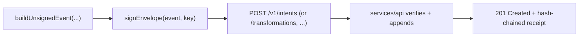

Two SDKs exist today, at the same abstraction level, both checked against the same frozen conformance vectors so they're provably interoperable rather than just individually correct.

| Language | Package | Install |
| --- | --- | --- |
| TypeScript | `packages/sdk-typescript` (`@act/sdk`) | `pnpm add @act/sdk` (workspace) |
| Python | [`sdks/python`](https://github.com/JGalego/ACT-protocol/tree/main/sdks/python) (`act-sdk`) | `pip install -e ".[dev]"` |

Both cover the same four layers:

| Layer | TypeScript | Python | Contents |
| --- | --- | --- | --- |
| Canonicalization | `packages/core` | `act_sdk.core` | RFC 8785 canonicalization, SHA-256 digests, UUIDv7 ids |
| Cryptography | `packages/crypto` | `act_sdk.crypto` | Ed25519 keys, DSSE envelope sign/verify, key lifecycle evaluation |
| Event building | `event-builder.ts` | `act_sdk.event_builder` | Unsigned-event construction with protocol defaults filled in |
| HTTP client | `client.ts` | `act_sdk.client` | A thin, retrying client for the ACT reference API |

## Building and submitting an event

Every write to `services/api` follows the same shape regardless of SDK: build an unsigned event, sign it locally, submit the signed envelope. The server never signs on a caller's behalf.

## Proving cross-language interoperability

`conformance/vectors/generate-vectors.ts` freezes expected canonical bytes, digests, DSSE pre-authentication-encoding bytes, and signatures — ported directly from `packages/core`'s and `packages/crypto`'s own test suites. Every SDK's test suite loads and reproduces the exact same vectors:

- TypeScript: `conformance/vectors/vectors.test.ts`
- Python: `sdks/python/tests/test_vectors.py`

Ed25519 signatures are deterministic per RFC 8032, so a passing `test_signatures` in the Python suite is a genuine cross-language proof: the same keypair and message produce the identical signature bytes the TypeScript implementation produced when the vectors were generated — not just "both look plausible."

:::tip[Porting a new SDK] `conformance/vectors/` is the natural starting point for a future Go or Rust SDK (see the [Roadmap](/roadmap/)) — reproduce those vectors byte-for-byte before writing anything else, the same way `sdks/python` did. :::

## Two RFC 8785 edge cases worth knowing about

If you're implementing a new SDK yourself, these are the two places a naive port silently diverges from the spec:

- **Number formatting.** RFC 8785 requires JSON numbers to match ECMAScript's `Number::toString`, which is _not_ what most languages' native float formatting produces. Python's SDK reuses `repr()` only to get the shortest round-tripping decimal digits, then re-formats them with ECMA-262's exact fixed/exponential-notation thresholds — see `act_sdk.core.canonical`'s module docstring for the edge cases (negative zero, the 2^53 precision-loss boundary, subnormals).
- **Key ordering.** RFC 8785 §3.2.3 requires object keys sorted by UTF-16 code unit sequence, not a language's default code-point ordering. Python's SDK sorts by each key's UTF-16BE encoding rather than the raw string, so a key containing a character outside the Basic Multilingual Plane sorts identically across every ACT implementation.
