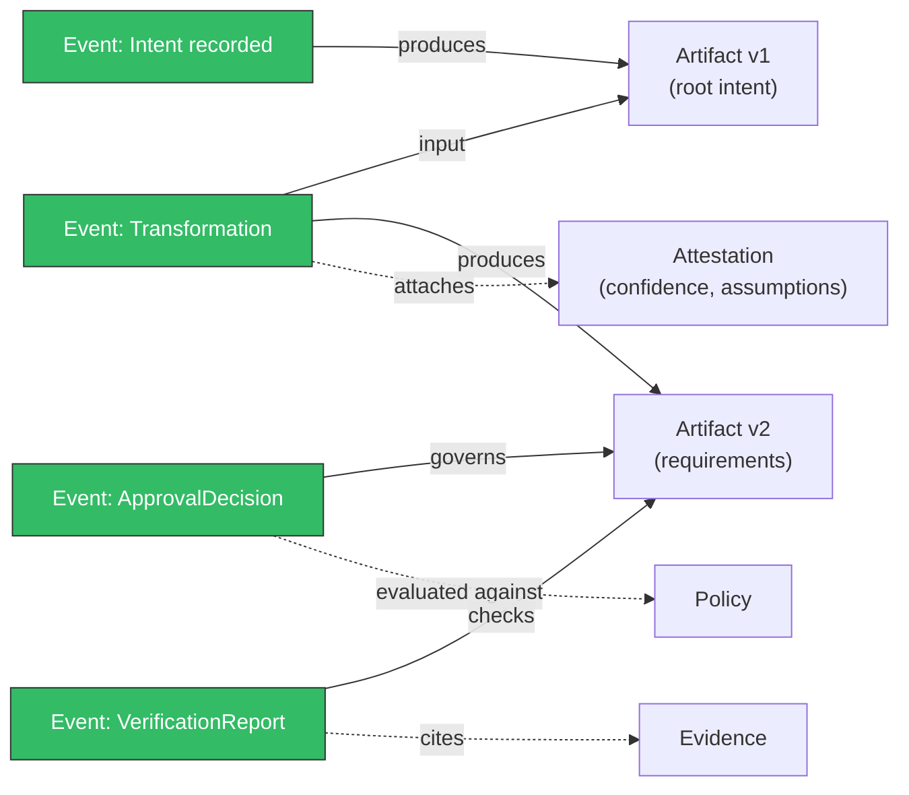

The normative specification lives in [`spec/ACT-1.0.md`](https://github.com/JGalego/ACT-protocol/blob/main/spec/ACT-1.0.md) on GitHub, alongside four companion documents. This page is a map of that content, not a replacement for it — where this page and the spec disagree, the spec is authoritative.

## The normative document

[`spec/ACT-1.0.md`](https://github.com/JGalego/ACT-protocol/blob/main/spec/ACT-1.0.md) covers, in order: notational conventions, terminology, identities and versions, canonicalization and signatures, the event envelope and ledger receipts, ledger and storage semantics, artifacts/transformations/intent, approval and accountability, confidence, uncertainty, evidence/verification/challenges, policy evaluation, the formal model, federation, privacy, versioning/extension/conformance, and security/privacy considerations.

## Companion documents

| Document | Covers |
| --- | --- |
| [`spec/semantic-model.md`](https://github.com/JGalego/ACT-protocol/blob/main/spec/semantic-model.md) | The entities `ACT-1.0.md` references (Intent, Interpretation, Artifact, Transformation, Revision, Evidence, Approval, Authorization, Accountability Assignment, Confidence Assessment, …) and the relations between them. |
| [`spec/state-machines.md`](https://github.com/JGalego/ACT-protocol/blob/main/spec/state-machines.md) | Every lifecycle (artifact version, approval, challenge, effective intent) as an explicit state machine — every transition is one new signed Event, never a mutation of an existing record. |
| [`spec/federation.md`](https://github.com/JGalego/ACT-protocol/blob/main/spec/federation.md) | Peer-to-peer federation between independently operated ledgers: bundle format, trust policy, causal order via `causal_parents` (never wall-clock time). |
| [`spec/conformance.md`](https://github.com/JGalego/ACT-protocol/blob/main/spec/conformance.md) | The Core, Cryptographic Integrity, Secure Service, Federation, SDK, and Explorer conformance profiles, and the fixture categories a claimant must pass to certify each. |

## Node classes and lineage

The semantic graph has five signed node classes — **Artifact**, **Transformation**, **Attestation**, **Policy**, **Evidence** — plus **Events**, the append-only record of changes to the other four. Lineage between nodes is represented as typed, many-to-many edges pointing from a new node to the existing node(s) it depends on; signed records never contain mutable `children` or "current state" arrays — descendants and current heads are always computed projections, never signed facts.

Every solid arrow is lineage (`inputs`/`outputs`); every dashed arrow is an attached, attributed claim about the node it touches. Nothing here is ever rewritten in place — a correction is a new Event producing a new Artifact version or a new Attestation, never a mutation of an existing one.

## The transformation contract

Every Transformation record must include `transformation_id`, `mode`, `actor`, `inputs`, `outputs`, `semantic_change_claim`, `assumptions`, `ambiguities`, `alternatives`, `rationale`, `confidence_assessments`, `uncertainties`, `evidence`, `verification_results`, `applicable_policy`, and `approval_requirement`.

`mode` is exactly one of `preservation` or `discovery`. `semantic_change_claim.classification` is one of:

| Classification | Meaning |
| --- | --- |
| `exact-preservation` | The output is claimed equivalent to the input under a cited equivalence procedure. |
| `clarification` | The output restates the input's meaning without narrowing or changing it. |
| `constraint-refinement` | The output adds or tightens a constraint consistent with the input. |
| `assumption-introduction` | The output relies on a new stated assumption not present in the input. |
| `alternative-proposal` | The output is offered as a candidate alternative, not yet adopted. |
| `intent-challenge` | The output disputes or challenges the input's stated intent. |
| `semantic-modification` | The output changes the meaning of the input. |

A classification is an **attributed claim**, identifying the actor who made it — not an automatically established fact. Policy must require approval for any transformation classified `semantic-modification` when its subject is part of an effective intent baseline; whether approval is required is always a policy **evaluation**, never a mutable boolean field on the transformation record itself.

## Intent authority and revision

A conforming implementation distinguishes:

- **root intent** — the immutable Genesis-event-originated Intent artifact version that begins an intent lineage.
- **proposed intent** — an Intent artifact version submitted but not yet selected as effective by the applicable authority policy.
- **effective intent** — the Intent artifact version an authority policy currently designates as the approved baseline for a project or branch. Exactly one Intent version may be effective per (project, branch) at a time.

## Versioning

Four version identifiers change independently: `protocol_version` (this specification's version, e.g. `act/1.0`), schema version (per-`$id` version segment under `schemas/`), API version (the `/v1` path prefix), and implementation version (the semantic version of a specific SDK, service, or CLI build). See [`docs/versioning.md`](https://github.com/JGalego/ACT-protocol/blob/main/docs/versioning.md) on GitHub for the full compatibility and extension rules.
